# CareSphere

> An AI-powered, cloud-native healthcare platform built for the **BharatBuild Hackathon**.
> Engineered with **FastAPI**, **Amazon Web Services (AWS)**, and **React + Tailwind CSS**.

---

## 🌟 Architecture & Core Modules

```mermaid
flowchart LR
    subgraph Frontend["React 19 + Tailwind CSS"]
        SympUI["Symptom Intelligence"]
        RxUI["Prescription Vault & Schedule"]
        SafetyUI["Medication Safety Engine"]
        TimelineUI["Health Timeline"]
        EmergencyUI["Emergency Health Card (QR)"]
        AlertsUI["Alerts & Follow-up Center"]
        DoctorUI["Doctor Dashboard"]
        SimplifierUI["Multilingual Simplifier"]
    end

    subgraph Backend["FastAPI Core (/api/v1)"]
        Router["Mangum / AWS Lambda Handler"]
        Cedar["Cedar Authorization Policies"]
    end

    subgraph AWS["AWS Cloud Integrations"]
        DDB[("AWS DynamoDB\nStructured Health Records")]
        S3[("AWS S3\nPrescriptions & QR Codes")]
        Bedrock["Amazon Bedrock\nOCR, Triage, Regional Simplifier"]
        OpenSearch["AWS OpenSearch\nDrug Knowledge Base & DDI"]
        Cognito["AWS Cognito\nUser Authentication"]
        EventBridge["AWS EventBridge & Step Functions\nReminders & Escalation"]
        Amplify["AWS Amplify Hosting\nFrontend Delivery"]
    end

    Frontend --> Backend
    Backend --> AWS
```



---

## 🚀 The 6 Core Modules

### 1. Symptom Intelligence
- **Symptom Entry**: Captures symptoms, duration, and pain severity.
- **Adaptive Q&A**: Employs AWS Bedrock to generate dynamic, context-aware clinical follow-up questions.
- **Clinical Risk Output**: Triage categorization into `EMERGENCY`, `HIGH_RISK`, `MODERATE_RISK`, or `LOW_RISK` with immediate action windows and red-flag identification.

### 2. Prescription Intelligence & Digital Vault
- **Multimodal OCR**: Uploads PDF or image to AWS S3 and extracts medicine names, dosages, frequency, duration, and meal instructions using Amazon Bedrock.
- **Clean Medication Schedule**: Organizes prescriptions into an intuitive 4-phase daily pill organizer (Morning, Afternoon, Evening, Night).
- **Digital Vault**: Stores and indexes historical prescriptions in S3.

### 3. Medication Safety Engine
- **Duplicate Brand Detection**: Detects different brand names concealing the same active salt (e.g. *Crocin Advance* + *Dolo 650* $\rightarrow$ Paracetamol double-dosing hazard).
- **Drug-Drug Interaction (DDI)**: Evaluates combinations (e.g. *Warfarin* + *Aspirin/Disprin*, *Sildenafil* + *Nitrates*) with AWS OpenSearch.
- **Explainable AI (XAI)**: Alerts are formatted into 3 transparent cards:
  - **Why**: Pharmacological/biochemical mechanism.
  - **Concern**: Direct clinical danger and patient symptom risk.
  - **Action**: Actionable steps for both patient and clinician.

### 4. Health Timeline
- **Chronological Aggregator**: Stores events (symptoms, prescriptions, alerts, consults, lab reports) in AWS DynamoDB.
- **Categorized Streams**: Instant filtering by event category and expandable structured clinical metadata.

### 5. Emergency Health Card & QR
- **Minimal Vital Emergency Info**: Blood group, critical allergies, active medications, ICE contacts, and special clinical instructions.
- **Dynamic QR Code**: Generates high-resolution scannable QR codes stored in S3.
- **Paramedic Public View**: Unauthenticated emergency portal protected under Cedar policy for instant trauma access.

### 6. Alerts + Follow-up Center
- **Missed Follow-up Detection**: Scans records for overdue consultations or tests.
- **Urgent Red Flags**: Real-time push warnings for severe symptoms or lethal drug interactions.
- **Smart Medicine Reminders**: Interactive "Mark as Taken" and "Snooze" actions that dispatch adherence telemetry via AWS EventBridge.

---

## 🌐 Additional Capabilities

- **Medical Language Simplifier**: Bedrock-powered tool converting technical Latin doctor notes into 5th-grade plain English and translating into regional languages (**Hindi**, **Telugu**, **Tamil**, **Bengali**, **Marathi**).
- **Family Health Profiles**: Switch effortlessly between household members (*Self*, *Father*, *Mother*, *Child*).
- **Doctor Dashboard**: Clinician view with patient history, active meds, safety issues, and AI recommendations.

---

## 🛠️ AWS Tracks (Ship It & Build It)

| AWS Service | Functionality |
| :--- | :--- |
| **AWS Lambda & API Gateway** | Serverless execution via Mangum adapter (`infra/template.yaml`) |
| **AWS DynamoDB** | Structured health records, alerts, and patient profiles |
| **AWS S3** | Prescription document storage & emergency QR badge hosting |
| **Amazon Bedrock** | OCR, symptom triage, medical language simplifier |
| **AWS OpenSearch** | Indexed Indian Pharmacopoeia & Drug Interaction knowledge base |
| **AWS Cognito** | Patient & Doctor authentication with JWT tokens |
| **AWS EventBridge + Step Functions** | Reminder scheduling & missed checkup escalation |
| **AWS Amplify Hosting** | Frontend deployment specification (`frontend/amplify.yml`) |
| **Cedar Policies** | Fine-grained role & relationship authorization (`infra/cedar/policies.cedar`) |
| **SAM CLI + LocalStack** | Local cloud simulation (`infra/docker-compose.yml`) |
| **PartyRock** | Rapid AI app blueprint for symptom triage (`infra/partyrock/prompt_templates.md`) |

---

## ⚡ Quickstart Guide

### Prerequisites
- Python 3.11+
- Node.js 18+ and npm

### 1. Backend Setup
```bash
# Navigate to backend and activate virtual environment
cd backend
python -m venv venv
source venv/bin/activate  # On Windows: .\venv\Scripts\activate

# Install dependencies
pip install -r requirements.txt

# Run test suite
pytest tests/test_backend.py -v

# Start FastAPI server
uvicorn app.main:app --reload --port 8000
```
API Documentation will be live at: **http://127.0.0.1:8000/docs**

### 2. Frontend Setup
```bash
# In a new terminal, navigate to frontend
cd frontend

# Install dependencies
npm install

# Start Vite development server
npm run dev
```
Frontend Dashboard will be live at: **http://localhost:5173**

---

## 🧪 Verification & Test Suite
All backend tests pass with 100% success rate:
```bash
pytest backend/tests/test_backend.py -v
```
Verifies:
- ✅ Module 1: Symptom entry, adaptive Q&A generation, and emergency red-flag triage
- ✅ Module 2: Prescription upload simulation, OCR extraction, and 4-slot clean schedule
- ✅ Module 3: Duplicate active ingredient detection (Dolo + Crocin) & Drug interaction (Warfarin + Aspirin)
- ✅ Module 4: DynamoDB Health Timeline chronological ordering
- ✅ Module 5: Emergency Health Card generation and scannable QR Code
- ✅ Module 6: Alerts retrieval and medicine reminder adherence actions
- ✅ Family Health Profiles & Doctor Dashboard Cedar authorization
- ✅ Amazon Bedrock Medical Language Simplifier (Hindi + regional translation)

---

## 📁 Repository Layout

```text
CareSphere/
├── backend/
│   ├── app/
│   │   ├── core/                  # AWS clients, security, Cedar helpers
│   │   ├── data/                  # Local triage and medicine knowledge
│   │   └── modules/               # Feature routers, schemas, and services
│   ├── tests/                     # FastAPI regression tests
│   └── requirements.txt
├── frontend/
│   ├── src/components/            # React healthcare workflows
│   ├── src/services/api.js        # Frontend API client
│   ├── amplify.yml                # AWS Amplify build configuration
│   └── package.json
├── infra/
│   ├── template.yaml              # AWS SAM infrastructure template
│   ├── docker-compose.yml         # Local infrastructure services
│   ├── cedar/                     # Authorization policies
│   └── partyrock/                 # Bedrock prompt blueprints
├── run_all.bat                    # Start backend and frontend on Windows
└── README.md
```

## 🔌 API Surface

The FastAPI service is mounted under `/api/v1`:

| Area | Important endpoints |
| :--- | :--- |
| Symptom Intelligence | `POST /symptoms/adaptive-qa`, `POST /symptoms/analyze`, `POST /symptoms/assess-final-risk` |
| Health Chatbot | `POST /health-chat/message` |
| Prescriptions | `POST /prescriptions/upload`, `GET /prescriptions/vault/{patient_id}` |
| Medication Safety | `POST /safety/audit` |
| Health Timeline | `GET /timeline/{patient_id}`, `POST /timeline/events` |
| Emergency Card | `GET /emergency/card/{patient_id}`, `GET /emergency/public/{patient_id}` |
| Alerts | `GET /alerts/{patient_id}`, `POST /alerts/reminder-action` |
| Profiles and doctors | `GET /family/{family_id}`, `GET /doctor/summary/{patient_id}` |
| Localization | `POST /translate/simplify` |

Interactive OpenAPI documentation is available at `http://127.0.0.1:8000/docs` while the backend is running.

## 🧠 Symptom Assessment Flow

1. A patient describes symptoms in natural language.
2. The backend checks matching symptom knowledge in DynamoDB when available and combines it with curated triage rules.
3. Focused follow-up questions are returned for the reported domain, including fever, diabetes, headache, cough, breathing, stomach, urinary, and skin symptoms. Unknown descriptions receive personalized general questions based on the submitted text.
4. Answers are submitted incrementally from the React client.
5. Rule-based red-flag logic assigns a triage category and urgency window.
6. Explainable findings show the possible condition category, evidence from the input, and recommended action.
7. Amazon Bedrock can add concise clinical context without replacing a qualified clinician.
8. The completed assessment and answers are written to the patient health timeline.

CareSphere is decision support, not a diagnosis tool. Emergency symptoms should be evaluated by local emergency services immediately.

## ⚙️ Configuration

The backend defaults to local mock mode so the project can run without AWS credentials. For AWS-backed deployments, configure environment variables through the deployment environment rather than committing secrets:

```env
AWS_REGION=ap-south-1
AWS_ACCESS_KEY_ID=your-access-key
AWS_SECRET_ACCESS_KEY=your-secret-key
AWS_MOCK_MODE=false
DYNAMODB_TABLE_RECORDS=CareSphere_HealthRecords
DYNAMODB_TABLE_ALERTS=CareSphere_Alerts
DYNAMODB_TABLE_PROFILES=CareSphere_Profiles
S3_BUCKET_NAME=caresphere-prescriptions-and-qr
BEDROCK_MODEL_ID=anthropic.claude-3-sonnet-20240229-v1:0
OPENSEARCH_ENDPOINT=https://your-opensearch-endpoint
COGNITO_USER_POOL_ID=your-user-pool-id
COGNITO_APP_CLIENT_ID=your-app-client-id
```

Never commit `.env` files, AWS access keys, Cognito secrets, or production patient data. The root `.gitignore` excludes common local credentials, virtual environments, caches, and frontend build artifacts.

## 🧪 Development Commands

From the repository root:

```powershell
# Backend tests
.\venv\Scripts\python.exe -m pytest -q backend/tests/test_backend.py

# Backend server
.\venv\Scripts\python.exe -m uvicorn app.main:app --app-dir backend --reload --port 8000

# Frontend checks
Push-Location frontend
npm ci
npm run lint
npm run build
npm run dev
Pop-Location
```

On Windows, `run_all.bat` starts both services in separate terminals. The Vite development server proxies `/api` requests to the FastAPI service at `http://127.0.0.1:8000`.

## 🚀 Deployment Notes

- **Frontend:** deploy the `frontend` directory using the included `amplify.yml`. Amplify builds the Vite application and serves the `dist` artifact.
- **Backend:** deploy the FastAPI application through the SAM template in `infra/template.yaml`, using API Gateway and Lambda via Mangum.
- **Data:** provision DynamoDB tables, S3 buckets, OpenSearch, Cognito, EventBridge, and Step Functions with least-privilege IAM policies.
- **Authorization:** review `infra/cedar/policies.cedar` before production deployment and keep patient, doctor, and emergency access paths separated.
- **Observability:** configure CloudWatch logs, alarms, and audit trails for Bedrock calls, health-record writes, emergency-card access, and reminder actions.

## 🤝 Contribution Workflow

1. Create a focused branch for a feature or fix.
2. Keep backend changes inside the owning module and add or update a targeted test.
3. Run backend tests plus `npm run lint` and `npm run build` before opening a pull request.
4. Do not include secrets, real patient information, generated build output, or local virtual environments in commits.
5. Describe API contract changes and AWS resource changes in the pull request.

## ⚠️ Clinical and Security Disclaimer

CareSphere provides general health information and decision support for demonstration and development purposes. It does not diagnose conditions, prescribe medication, or replace a licensed healthcare professional. Production deployments must complete clinical validation, privacy review, threat modeling, accessibility review, and compliance checks appropriate to the target region.

